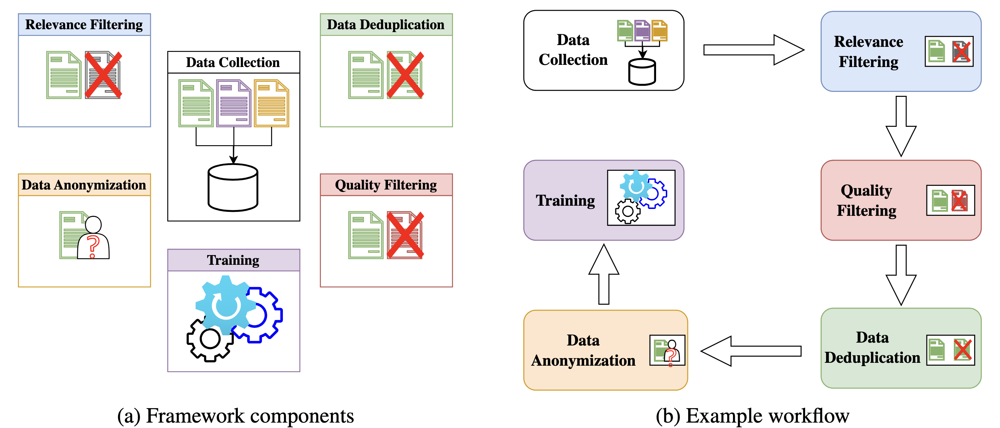

# CyLLM-DAP: Cybersecurity Domain-Adaptive Pre-training Framework of Large Language Models

This repository contains the code for CyLLM-DAP, a framework designed to simplify the domain-adaptive pretraining process of LLMs to create cybersecurity-specific LLMs. The framework has six main components:



1. **Data Collection**: Supports the collection of data from various sources such as web data (Common Crawl) and academic papers (S2OCR).
2. **Relevance Filtering**: Determines the relevance of the data to the cybersecurity domain.
3. **Quality Filtering**: Calculates quality metrics and filters out low-quality documents based on rules and thresholds.
4. **Data Deduplication**: Removes duplicated entries using Locality-Sensitive Hashing (LSH).
5. **Data Anonymization**: Uses the Presidio anonymizer to remove or hide Personally Identifiable Information (PII) from the data.
6. **Training**: Provides simple scripts for pretraining and fine-tuning.

Please note that not all the source code is implemented from scratch; some of the code is based on available code (e.g., Huggingface example code, Red Pajama, etc.). The default workflow in the picture is for reference only. Users can choose a different workflow based on their tasks and needs.
## Important Notice:

The framework is currently being updated to include more data and models. 

## Prerequisites

- The source code is written in Python. A virtual environment should be created to prevent conflicts with existing libraries in your system.
- Download the `warc3` library (https://github.com/jpbruinsslot/warc3) and place it in the running directory.

Please note that there could be conflicts among libraries. The solution is to create separate virtual environments for each component, as each component can be run independently.
- For data collection, you need libraries to work with commoncrawl (`warcio`, `trafilatura`), huggingface (`datasets`), book (`libgen_scraper`)
- For data anonymization, `presidio` libraries are required
- For deduplication, `datasketch`
- For language filtering, `ftlangdetect`
- For data loaders, `jsonlines`
- For quality filtering, `stop_words`
- For training, consider install necessary libraries to work with HuggingFace trainers `transformers`, `trl`, `evaluate`, `peft`
## Quick Start

To start using the framework, please review the `main.py` file to understand how to use each component.
This should be done after the required libraries for the component are installed, you can edit the `main.py` to test the component.

For a simple test, run:
```bash
python3 main.py
```

There is a `manager.py` file to support the initialization of objects based on configuration. This manager class is utilized in the testers in `./testers/`.

## Code Hierarchy

The framework is implemented using an object-oriented approach.

- `base`: Contains base classes for implementing other classes.
- `collectors`: Contains classes for implementing the collector objects. Each collector supports different data sources. Note that you need your own API key for S2OCR using `https://www.semanticscholar.org/product/api#api-key-form`
- `data_managers`: Contains classes for loading data (`DataLoader`) and saving data (`DataSaver`). These classes are used in other components to load the data, perform the related functions, and save it back to the directory.
- `anonymizer`: Contains the anonymizing class. 
- `deduplicators`: Contains classes to support the deduplication process. 
- `filters`: Contains various filtering classes to support the relevance filtering process.
- `internal_data`: Contains internal data, including keywords, URLs, patterns, toxic words, etc.
- `quality_filters`: Contains classes for quality filtering.
- `toxic_filter`: Contains classes for toxic filtering.
- `trainers`: Contains simple training scripts.
- `workspace`: Default workspace to run the functions.


## Data Hierarchy

In general, when running the code, you need a workspace directory. The necessary subdirectories will be automatically created.

## Dataset

- To access the training data for domain-adaptive pretraining purposes, please consider `khangmacon/myllm`. 
- To access the CyLLama, please consider `khangmacon/cyllama3`.
- To access the CyMistral, please down from this link: `https://drive.google.com/file/d/10HOa791FhU3cyvUjb-tuL9zAtxy4AULj`
- S2OCR Data: `https://drive.google.com/file/d/1r51q7GJelW0H-LTAs4N76U4YVGOoxdTF`
- Book Data: `https://drive.google.com/file/d/13PYxOIegbpdQeP_YOQu768qOtEhAbccP`
- Common Crawl Data: `https://drive.google.com/file/d/1RPzKSmbnp1bVt2Jf2SZGct7JK2tQg5M7`
- Wikipedia Data: `https://drive.google.com/file/d/10Q7SDia3UgYB5tGSNG1x60GrOGvAR_eb`
- The data is stored in Jsonline objects; each line is a document.

- Cyber classification data: `khangmacon/cyberregression`. Each item is a cybersecurity text with a relevance score in the range [0, 1] (showing the relevancy level of the text to cybersecurity) and a quality score (if the text is of good quality)
- Model for cyber regression: `khangmacon/cyber_regression_model`. This model was trained to classify a text into cyber/noncyber using the cyberregression data. When filtering webpages, use the longest paragraph  (>512) or a random slice of 512 characters. The recommended threshold is 0.6.
## Acknowledgements

